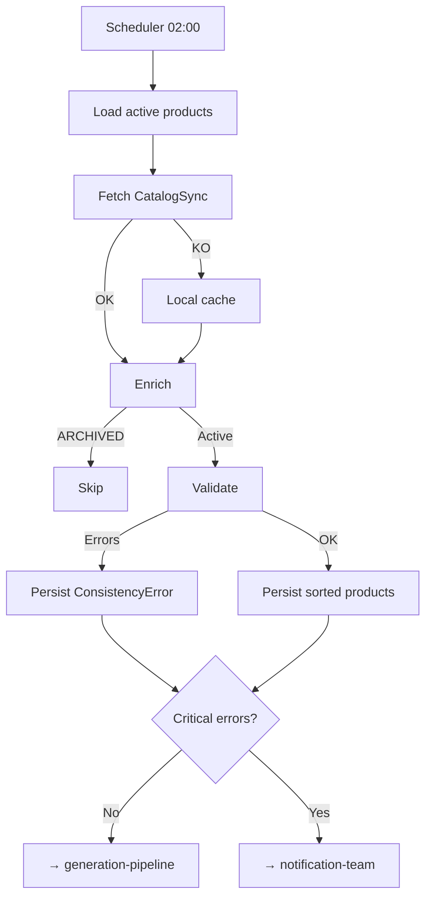

# Codebase Analysis — Report Examples

This document illustrates the outputs produced by `codebase-analysis` at each key step.

---

## Example 1 — Phase 0: Cartography (medium repo)

```
CARTOGRAPHY — catalog-service
───────────────────────────────
Estimated size: ~18k lines, ~120 classes

Identified units:

  [HIGH]   adapter/out/persistence          [module]      ~35 classes
  [HIGH]   service/product_sync_generator   [component]   ~20 classes
  [MEDIUM] service/product_enrichment       [subsystem]   ~28 classes
  [MEDIUM] adapter/config/                  [module]      ~12 classes
  [LOW]    adapter/in/web/                  [module]      ~25 classes

Already documented (skipped unless requested):
  none

Strategy: medium (phases by layer, single conversation)

Confirm, adjust types/priorities, or exclude units before continuing.
```

---

## Example 2 — Phase 0: Cartography (large repo)

```
CARTOGRAPHY — my-enterprise-app
──────────────────────────────────
Estimated size: ~85k lines, ~420 classes

Identified units:

  [HIGH]   order-management     [bounded-context]   ~80 classes
  [HIGH]   payment-processing   [subsystem]         ~45 classes
  [HIGH]   inventory            [bounded-context]   ~60 classes
  [MEDIUM] notification         [component]         ~20 classes
  [MEDIUM] reporting            [module]            ~35 classes
  [LOW]    admin-config         [module]            ~15 classes

Already documented (skipped unless requested):
  none

Strategy: large — 1 conversation per HIGH/MEDIUM unit recommended

Confirm, adjust types/priorities, or exclude units before continuing.
```

---

## Example 3 — Phase 2: attribute groups with placeholders `?`

Phase 2 captures what is visible in constructors and field declarations.
`?` marks information not yet visible — to be completed by Phase 3 or 4.

```
### Domain Model — Product

Entity: ProductCatalogEntry — marker: lifeCycleStatus (CatalogState) — observed values: PENDING, ACTIVE, CANCELLED, ARCHIVED

Group "Identifiers" : sku, ean, ref
  → Source         : External app (CatalogSync JSON)
  → Validation     : none (free strings)
  → Transformation : none

Group "Lifecycle" : lifeCycleStatus, revision
  → Source         : External app (CatalogSync JSON)
  → Validation     : CTR_COMMON_FORMAT_STATUS, CTR_COMMON_FORMAT_INTEGER  [ProductGenerator:207-214]
  → Transformation : parsed via CatalogState.valueOf()  [ProductGenerator:171]

Group "Existence dates" : estimatedStart, realStart, estimatedEnd, realEnd, lastUpdateDate
  → Source         : External app (CatalogSync JSON)
  → Validation     : CTR_COMMON_FORMAT_DATE (WARNING if invalid)  [AbstractProductDomainModelGenerator:110-238]
  → Transformation : ? — formatter selection logic not yet read (Phase 3 will complete)

Group "Validity dates" : validityStartDate, validityEndDate
  → Source         : ? — computed internally, mechanism not yet traced (Phase 3 will complete)
  → Validation     : none visible
  → Transformation : ? — same as Source

Group "Catalog context" : category, seller
  → Source         : ? — resolved from DB at construction time (Phase 4 will complete)
  → Validation     : none
  → Transformation : none visible

Group "Technical fields" : generationDate, originalValues
  → (no detail needed — auto-populated)
```

After Phase 3 completes, `?` on "Existence dates" and "Validity dates" are filled in:

```
Group "Existence dates"
  → Transformation : CATALOGSYNC_EXTRACT_NEW_EFFECTIVE_DATE_FORMATTER (EXTRACT)
                     CATALOGSYNC_DELTA_EFFECTIVE_DATE_FORMATTER (DELTA)  [AbstractProductDomainModelGenerator:105-106]

Group "Validity dates"
  → Source         : Produced internally — computed via SyncResult.getValidityDatesWithExpiredProduct()
  → Transformation : validityEndDate = MAX_DATE for current state, predecessor.lastUpdateDate otherwise
                     [AbstractGeneratorWithDeltaValidation:860-876]
```

After Phase 4 completes, `?` on "Catalog context" is filled in:

```
Group "Catalog context"
  → Source         : Produced internally — resolved via CategoryPersistPort.findByRef(sellerIdA/B)
                     at construction time in generateAndValidate()  [ProductGenerator:185-196]
```

No remaining `?` — all placeholders resolved. No `[UNRESOLVED]` needed.

---

## Example 3b — Unresolved placeholder at end of analysis

When a `?` cannot be resolved (runtime-only value, external system undocumented):

```
Group "Pricing freeze dates" : dateFreeze, dateFreezeEngine, dateFreezeArchive
  → Source         : [UNRESOLVED — set at runtime by caller (Pipeline object),
                      origin outside this subsystem's scope]
  → Validation     : none visible
  → Transformation : none visible
```

`[UNRESOLVED]` is not a gap — it is a documented boundary of the analysis scope.

---

## Example 4 — Output gate at end of analysis

```
ANALYSIS COMPLETE — adapter/out/persistence [module]
──────────────────────────────────────────────────────
Scope       : com.....adapter.out.persistence
Key classes : ProductEntity, ConsistencyErrorEntity, ProductRepository,
              ConsistencyErrorRepository, ProductPersistService

Deliverables:
  ORIENTATION     : pivot=ProductPersistService, callers=SyncOrchestrationService,
                    pattern=Layered (JPA entities + service layer)
  DOMAIN MODEL    : 8 entities, 3 state markers (ProductStatus, OperationType, SourceType),
                    2 ? resolved / 0 unresolved
  BUSINESS LOGIC  : 3 rules, 2 entry points (saveAll, saveAllConsistencyErrors),
                    1 state transition (ACTIVE → ARCHIVED)
  INTEGRATION MAP : 0 IN, 1 OUT (Oracle DB via JPA), coupling violations: none
  RISK REGISTER   : 2 P0, 1 P1, 0 P2

PROMOTE-CANDIDATEs : 5 total
  - "Always sort by ID before saveAll() — causes ORA-00060 deadlock"
    → .claude/rules/database-operations.md   [high — prod incident + grep on 5 PersistServices]
  - "@Transactional(readOnly = true) mandatory on read methods"
    → .claude/rules/database-operations.md   [high — grep-confirmed in 8 repository classes]
  - "XxxEntity.fromDomainModel() / toDomainModel() pattern on all 8 entities"
    → .claude/memory-bank/systemPatterns.md  [high — grep-confirmed in 8 distinct files]
  - "PRODUCT, CONSISTENCY_ERROR: JPA entities exposed to Oracle deadlocks"
    → docs/ai/domain-glossary.md             [medium — appears across full persistence layer]
  - "Oracle DB via JPA/Hibernate — failure: transactional rollback"
    → docs/ai/data-sources.md               [medium — observed in this unit only]

What to do with these results?
  1. Capture in project memory
     → /architecture-document adapter-persistence type=module
  2. Export to folder
     → specify target path
  3. Keep in conversation only
     → nothing written

⚠️  Only option 1 feeds architecture-map.md and makes results available
    for future sessions on this repo.
```

---

## Example 4 — Generated analysis-plan file

```markdown
# Analysis plan — catalog-service
Date: 2026-03-23

## Statuses

| Status | Meaning |
|--------|---------|
| ⬜ | To do |
| ⏳ | In progress (active session) |
| ✅ | Documented (architecture-map.md updated) |
| 📁 | Exported to a folder |
| 💬 | Conversation only (not persisted) |
| 🚫 | Ignored (persistent decision) |

## Units

| Unit | Type | Risk | Status |
|------|------|------|--------|
| adapter/out/persistence | module | HIGH | ✅ documented |
| service/product_sync_generator | component | HIGH | ⏳ in progress |
| service/product_enrichment | subsystem | MEDIUM | ⬜ to do |
| adapter/config | module | MEDIUM | ⬜ to do |
| adapter/in/web | module | LOW | 🚫 ignored |

## Sessions

| Date | Unit analysed | Output chosen |
|------|--------------|---------------|
| 2026-03-23 | adapter/out/persistence [module] | ✅ memory → /architecture-document |
```

---

## Example 4b — Resume in session 2 (existing plan detected)

```
EXISTING PLAN DETECTED — docs/ai/analysis-plan-catalog-service.md
──────────────────────────────────────────────────────────────────────
✅  adapter/out/persistence           [module]          HIGH    → documented  (2026-03-23)
📁  domain-model                      [bounded-context] HIGH    → exported (2026-03-23)
    ↳ Resume: /codebase-analysis doc=docs/ai/analysis/domain-model/domain-model-analysis.md
⬜  service/product_sync_generator    [component]       HIGH    → to do  ⚙️  ← recommended
⬜  service/product_enrichment        [subsystem]       MEDIUM  → to do
⬜  adapter/config                    [module]          MEDIUM  → to do
🚫  adapter/in/web                    [module]          LOW     → ignored

⚙️  = stored analysis parameters (objective, scope, context)

Resume with service/product_sync_generator [component]?
Options:
  - Confirm (continue with this ⬜ unit)
  - Resume a 📁 exported unit (see ↳ command above)
  - Choose a different unit
  - Mark a unit as 🚫 ignored or ⬜ to do
  - Modify a unit's parameters (objective, scope, context)
  - Redo the full cartography
```

---

## Example 4b-bis — Resume with stored parameters (new session)

Scenario: the previous session defined objective and scope for `service/product_sync_generator`.
These parameters are in `## Analysis details` of the plan. New conversation.

```
User: "Resume the analysis of catalog-service.
       Plan: docs/ai/analysis-plan-catalog-service.md.
       Next unit: service/product_sync_generator [component]."

→ Skill reads the plan, finds Analysis details, displays:

Stored parameters for service/product_sync_generator:
  Objective : b) Debug / investigate a problem
  Scope     : service/product_sync_generator, application/port/out/generation
  Freedom   : indicative
  Context   : NPE in prod on generateAndValidate from the nightly scheduler

Confirm or modify before starting?

User: "Change the objective to a) modify/extend — we decided to refactor"

→ Skill:
  Objective updated: a) Modify / extend.
  Plan updated (## Analysis details).
  Recalibration: Phase 2 (domain model) + Phase 5 (risks) prioritised.
  Starting Phase 1 (light)...
```

---

## Example 4c — Manual unit addition

```
User: "Add cross-cutting-transactions [subsystem] HIGH"

→ Skill:

Unit to add: cross-cutting-transactions [subsystem] HIGH

A few questions to orient the analysis:

1. SCOPE — Packages or classes to analyse?
   → list (e.g. "service/cache, adapter/config/cache")
   → "nothing specific" — I will search myself in the project

2. FREEDOM — If scope provided, it is:
   → "exclusive"   : I search only in these packages
   → "indicative"  : starting point, I explore dependencies if relevant

3. OBJECTIVE — Why this analysis?
   a) Modify / extend this unit
   b) Debug / investigate a problem
   c) Understand the architecture before a task
   d) Prepare a refactoring
   e) Document for the team
   → or describe your objective freely

4. KNOWN CONTEXT — What you already know:
   → key classes, expected behaviour, suspected issues, entry points...
   → "nothing" if starting from scratch

User:
  1. "nothing specific"
  2. (not applicable)
  3. "b) debug — we have intermittent deadlocks in prod that we can't reproduce"
  4. "I know it involves ProductPersistService and probably the nightly scheduler"

→ Plan updated:
  cross-cutting-transactions  [subsystem]  HIGH  ⬜ to do

→ Phase calibration:
  Objective "debug" → Priority: Phase 3 (business logic) + Phase 5 (risks)
  Context provided  → Anchor: ProductPersistService + scheduler
  Phase 1           : light (surface structure only)
```

---

## Example 4d — Modifying a unit's parameters

```
# During analysis — mid-conversation override

User: "Change the objective to a) modify/extend — we're going to evolve this component after all"

→ Skill:
  Objective updated: a) Modify / extend.
  Recalibration: Phase 2 (domain model) + Phase 5 (risks) prioritised. Phase 4 light.
  Phase 3 (already completed) kept as-is — re-run if you want to deepen it.

→ Plan updated (## Analysis details):
  ### cross-cutting-transactions
  - Objective : a) Modify / extend this unit    ← updated
  - Scope     : nothing specific
  - Freedom   : indicative
  - Context   : ProductPersistService, nightly scheduler

# Before starting a unit — scope override

User: "Change the scope of service/product_sync_generator to
      service/product_sync_generator, application/port/out/generation"

→ Skill:
  Scope updated: service/product_sync_generator, application/port/out/generation
  Current freedom: indicative (kept).

→ Plan updated:
  ### service/product_sync_generator
  - Objective : c) Understand architecture
  - Scope     : service/product_sync_generator, application/port/out/generation  ← updated
  - Freedom   : indicative
  - Context   : nothing

# Adding to context during analysis

User: "Add to context: we observed NullPointerExceptions in prod
      on generateAndValidate calls from the scheduler"

→ Skill:
  Context enriched. Re-running grep on generateAndValidate to correlate.

→ Plan updated:
  ### service/product_sync_generator
  - Context : nothing + NPE in prod on generateAndValidate from scheduler  ← enriched
```

---

## Example 4f — Status change

```
User: "Mark adapter/config as ignored"

→ Plan updated:
  adapter/config  [module]  MEDIUM  🚫 ignored

User: "Mark adapter/in/web as to do"

→ Plan updated:
  adapter/in/web  [module]  LOW  ⬜ to do
```

---

## Example 4g — Phase 2: attribute grouping (source / validation / transformation)

Entity analysed: `ProductEntity` (adapter/out/persistence)

```
Entity: ProductEntity

  Group "Technical fields": id, createdAt, updatedAt
    → Source         : produced internally (auto-generated)
    → Validation     : DB constraints only
    → Transformation : none

  Group "Business identifier": sku
    → Source         : external application (CatalogSync)
    → Validation     : not null, format [A-Z]{2}[0-9]{8}  [ProductValidator:34]
    → Transformation : uppercase forced on import          [ProductMapper:21]

  Group "Product data": productType, price, shortName
    → Source         : external application (CatalogSync)
    → Validation     : code present in reference data      [ProductValidator:52]
      ↳ shortName    : length ≤ 50                         [ProductValidator:67]
    → Transformation : code string → internal enum         [ProductMapper:38]
      ↳ price        : rounded to cent before mapping      [PriceConverter:12]

  Group "Computed state": status, calculationDate
    → Source         : produced internally (enrichment service)
    → Validation     : status/calculationDate consistency  [ProductService:118]
    → Transformation : multi-source aggregation            [ProductEnrichmentService:203]

⚠️  Finding: group "Product data" — price handled by a separate PriceConverter
    while productType and shortName go through ProductMapper.
    Signal: fragmented mapping logic. Refactoring candidate.

PROMOTE-CANDIDATE:
  - Pattern "code string → enum via Mapper" present on ProductEntity and ConsistencyErrorEntity
    → systemPatterns.md
```

---

## Example 5 — Export option 2 (single file)

File produced in `docs/notes/`:

**`adapter-persistence-analysis.md`**
```markdown
# Analysis — adapter/out/persistence [module]
Date: 2026-03-23

## Scope
com.....adapter.out.persistence
Key classes: ProductEntity, ConsistencyErrorEntity, ProductRepository,
             ConsistencyErrorRepository, ProductPersistService

## Data model
- ProductEntity (table PRODUCT) — 12 fields
- ConsistencyErrorEntity (table CONSISTENCY_ERROR) — 8 fields
...

## Identified business rules
1. saveAll() must receive a list sorted by ID (ORA-00060 deadlock)
2. All reads are @Transactional(readOnly = true)
3. Never an HTTP call inside a @Transactional

## Integrations
- Oracle DB via JPA/Hibernate

## Edge cases and risks
- Reproducible deadlock: two threads save PRODUCT in different orders
- N+1 on findAll() followed by individual processing

## PROMOTE-CANDIDATE
- "Always sort by ID before saveAll() — causes ORA-00060 deadlock"
  → .claude/rules/database-operations.md  [high — prod incident + coverage gap grep]
- "Pattern XxxEntity.fromDomainModel() / toDomainModel() present on 8 entities"
  → .claude/memory-bank/systemPatterns.md  [high — grep-confirmed in 8 distinct files]
```

This single file serves as a working document for iterative refinement:
```bash
/codebase-analysis doc=docs/notes/adapter-persistence-analysis.md      # refine
/architecture-document doc=docs/notes/adapter-persistence-analysis.md  # capitalise
```

---

## Example 5a — Phase 3 deliverable: BUSINESS LOGIC (no boundaries)

Mandatory deliverable produced at the end of Phase 3, before moving to Phase 4.
Each item is anchored to a `[File:line]` reference read during the phase.

Unit analysed: `product_sync_generator` (application/service/product_sync_generator)
→ Case without `?`: the flow stays in the pivot class, no untraced boundary.

```
BUSINESS LOGIC — product-sync-generator
───────────────────────────────────────────────────────────────────────
Entry points covered  : SCHEDULER — NightlyProductSyncScheduler.runSync()
                          [NightlyProductSyncScheduler:47]
                        TRIGGERED — SyncOrchestrationService.runExtract()
                          [SyncOrchestrationService:112]
                        TRIGGERED — SyncOrchestrationService.runDelta()
                          [SyncOrchestrationService:138]

Main flow             : generateAndValidate()
                          → checkCorrectedAndRemoveAlreadyExistingConsistencyErrors()
                          → generate()          [AbstractProductDomainModelGenerator:201]
                          → validate()          [AbstractProductDomainModelGenerator:245]
                          → persistResults()    [AbstractProductDomainModelGenerator:310]

Rules identified      :
  [BUSINESS POLICY] Feature toggle check before any generation
    → if (!featuresService.isEnabled(FeaturesEnum.PRODUCT_SYNC)) return;
    → at step generate()                          [AbstractProductDomainModelGenerator:198]
    → PROMOTE-CANDIDATE → decision.md            [high — grep-confirmed in 4 concrete classes]

  [BUSINESS POLICY] OperationType gates which checks run
    → EXTRACT : consistency checks only
    → DELTA   : delta comparator applied before checks
    → VALIDATION_PIPELINE : full generate + validate + persist
    → at step generateAndValidate()               [AbstractProductDomainModelGenerator:155]
    → PROMOTE-CANDIDATE → decision.md            [high — grep-confirmed in AbstractProductDomainModelGenerator]

  [OPERATIONAL CONSTRAINT] sourceType static field shared across threads
    → private static DataSourceEnum sourceType;
    →                                             [AbstractProductDomainModelGenerator:68]
    → race condition: errors marked against wrong source
    → PROMOTE-CANDIDATE → docs/ai/known-issues.md [high — static field, confirmed ISSUE-002]

  [IMPLICIT] markAndSaveMatchedErrorsAsFinished() clears errors for all sources
    → no source filter in query
    →                                             [AbstractProductDomainModelGenerator:939]
    → risk: false positives across concurrent pipelines
    → PROMOTE-CANDIDATE → docs/ai/known-issues.md [low — implicit, suspected from missing WHERE clause]

State transitions     : CatalogState — PENDING → ACTIVE | CANCELLED | ARCHIVED | DELIVERED
                          under condition: comparison result from LastModifiedDateComparator
                          [DeltaProductDomainModelGenerator:87]

PROMOTE-CANDIDATEs    : 4 identified (see classifications above)
```

---

## Example 5a' — Phase 3 deliverable: BUSINESS LOGIC (with boundaries `?`)

Same structure, but the flow crosses an untraced boundary — abstract method,
complex type, or opaque return value. Each boundary is marked `?` inline.

Unit analysed: `product_control_checker` (application/service/product_control_checker)
→ Case with `?`: the flow reaches `controlImpl.validate()` (abstract method) and
  `pojo.errorsMap` (return channel populated by unread implementations).

```
BUSINESS LOGIC — product-control-checker
────────────────────────────────────────────────────────────────────
Entry points covered  : TRIGGERED — product_sync_generator (validate + validateUniqueness)
                          [ProductControlChecker:8–14]
                        TRIGGERED — product_enrichment (validate without OperationType)
                          [ProductControlChecker:8]

Main flow             : validate(pojo, operationType)
                          → getListOfControlsByOperationType()   [ProductControlChecker:80]
                          → super.validate(pojo, selectedList)   [AbstractProductControlChecker:16]
                          → getControlsToUse()                   [AbstractProductControlChecker:18]
                          → forEach control → controlImpl.validate(pojo, control)
                              ? controlImpl.validate() — abstract, N impl. not read    [AbstractProductControlChecker:21]
                              ? pojo.errorsMap         — return channel, populated by
                                                         implementations above         [AbstractProductControlChecker:21]

Rules identified      :
  [BUSINESS POLICY] OperationType.VALIDATION_PIPELINE → controlsWithoutPricing
    → other OperationTypes → controlsWithPricing
    →                                                    [ProductControlChecker:81]
    → PROMOTE-CANDIDATE → decision.md                   [high — grep-confirmed]

  [BUSINESS POLICY] Matching: ControlImpl.code == Control.label
    →                                                    [AbstractProductControlChecker:36]
    → PROMOTE-CANDIDATE → local CLAUDE.md               [high — grep-confirmed]

  [IMPLICIT] availableControls empty → silent validation, no error
    →                                                    [AbstractProductControlChecker:15–25]
    → PROMOTE-CANDIDATE → docs/ai/known-issues.md       [medium]

  [IMPLICIT] Control with no matching ControlImpl → silent skip
    →                                                    [AbstractProductControlChecker:35–38]
    → PROMOTE-CANDIDATE → docs/ai/known-issues.md       [medium]

State transitions     : Control.controlImpl : null → ControlImpl resolved              [AbstractProductControlChecker:35–38]

PROMOTE-CANDIDATEs    : 4 identified (see classifications above)
```

**Review Loop — mandatory check triggered by `?`:**

```
Flow boundaries not followed — deep-dive available on request:
  → controlImpl.validate()  (abstract method, ~15 impl. per checker —
                             hint: ControlSpecificProductPriceRangeValue,
                                   ControlSpecificProductCategoryValue,
                                   ControlStatusIsPendingThenStockNotEmpty, …)
  → pojo.errorsMap          (return channel populated by implementations above)
```

---

## Example 5b — Enriched Phase 3: rules, coverage, implicits, classification

Unit analysed: `ProductPersistService` (adapter/out/persistence)

```
Identified rules:

  [INVARIANT] "A product must have a SKU before any persistence"
    → Extracted from: throw new ConsistencyException("CTR_PRODUCT_MISSING_SKU")
                      [ProductPersistService:87]
    → Coverage: ✅ saveAll() [ProductPersistService:87]
                ✅ update()  [ProductPersistService:134]
                ❌ importBatch() — rule absent  ← COVERAGE GAP
    → PROMOTE-CANDIDATE → .claude/rules/database-operations.md  [high — extracted from throw + coverage gap grep]

  [BUSINESS POLICY] "Products with ARCHIVED status are not enriched"
    → Extracted from: if (product.getStatus() == ProductStatus.ARCHIVED) return;
                      [ProductEnrichmentService:203]
    → Coverage: ✅ CatalogSync enrichment
                ✅ PricingEngine enrichment
    → PROMOTE-CANDIDATE → decision.md  [medium — business policy, mechanism-specific, may change]

  [OPERATIONAL CONSTRAINT] "saveAll() must receive a list sorted by ID"
    → Extracted from: ORA-00060 deadlock observed in prod (Phase 5)
    → Coverage: ✅ saveAll() — sort present [ProductPersistService:112]
                ❌ saveAllConsistencyErrors() — sort absent  ← COVERAGE GAP
    → PROMOTE-CANDIDATE → .claude/rules/database-operations.md  [high — prod deadlock + coverage gap grep]

  [IMPLICIT] "The nightly scheduler calls syncAll() before generateAll()"
    → No ordering constraint in code — tacit convention
    → Suspicion from: comment in SchedulerConfig:45
    → Risk: if order reversed, generateAll() works on non-enriched data
    → PROMOTE-CANDIDATE → .claude/rules/  [low — implicit, suspected from comment SchedulerConfig:45]
```

---

## Example 5c — Behavioural synthesis on demand (review loop)

```
User: "Show me the end-to-end flow for the nightly synchronisation"

→ Skill synthesises from phases 1-5 (no re-reading unless a step is missing):

Flow: nightly-synchronisation
──────────────────────────────────────────────────
Entry: SCHEDULER — daily cron 02:00 [NightlyProductSyncScheduler:23]

Steps:
  1. Load all active products from DB
  2. For each product → fetch CatalogSync (HTTP)
     → If CatalogSync KO: use local cache
  3. Enrich with CatalogSync data [ProductEnrichmentService:203]
     → If status == ARCHIVED: skip
  4. Validate consistency (Phase 3 rules)
     → If errors: persist ConsistencyError + continue
  5. Persist enriched products (list sorted by ID — critical rule)
  6. Trigger generation if no critical error

Triggered outputs:
  → generation-pipeline   if 0 critical error
  → notification-team     if nb errors > threshold (implicit threshold — see [IMPLICIT])

---


```

---

## Example 5d — Phase 4: entry points, integrations, coupling, deliverable

Unit analysed: `product-enrichment` [subsystem]

**Step 1 — Entry points exposed:**
```bash
grep -rn "@RestController\|@GetMapping\|@PostMapping" src/main/.../product_enrichment/ --include="*.java"
→ ProductEnrichmentController:22 : @PostMapping("/api/v1/enrich")

grep -rn "@Scheduled" src/main/.../product_enrichment/ --include="*.java"
→ (no results)
```

**Step 2 — Outgoing calls:**
```bash
grep -rn "HttpClient\|RestTemplate\|WebClient\|FeignClient" ...
→ CatalogSyncClient:34 : restTemplate.getForObject(...)
→ PricingEngineClient:67 : webClient.post()...
```

**Step 3 — Compact format:**
```
[IN]   REST POST /api/v1/enrich  →  EnrichmentRequest    |  failure: 400                  |  [ProductEnrichmentController:22]
[OUT]  CatalogSync API           →  ProductDTO           |  failure: local cache          |  [CatalogSyncClient:34]
[OUT]  PricingEngine API         →  PriceDTO             |  failure: exception            |  [PricingEngineClient:67]
[OUT]  Oracle DB (write)         →  ProductEntity        |  failure: rollback             |  [ProductPersistService:87]
[OUT]  Oracle DB (read)          →  ProductEntity (list) |  failure: exception            |  [ProductRepository:15]
```

**Step 4 — Coupling violations:**
```
grep : import.*adapter in application/
→ ProductEnrichmentService.java:12 : import ...adapter.out.persistence.ProductRepository
⚠️  VIOLATION : application/ imports adapter/out directly — bypasses port
→ PROMOTE-CANDIDATE → .claude/rules/hexagonal-architecture.md  [high — grep-confirmed]
```

**Step 5 — Outgoing triggers:**
```
→ generation-pipeline   if enrichment with no critical error
→ notification-team     if ConsistencyError count > threshold  [IMPLICIT — threshold undocumented]
→ (none other detected)
```

**Cross-reference Phase 1.3:**
```
Phase 1.3 imports: CatalogSyncClient, PricingEngineClient, ProductRepository, ProductEnrichmentPort
→ CatalogSyncClient      : explained [OUT CatalogSyncClient:34]
→ PricingEngineClient    : explained [OUT PricingEngineClient:67]
→ ProductRepository      : explained [OUT Oracle DB:87] + coupling violation flagged
→ ProductEnrichmentPort  : interface — implementation found via grep implements ProductEnrichmentPort
                           → ProductEnrichmentServiceImpl [adapter/out/enrichment:12]  ✅
Phase 1.3 coverage : all imports explained
```

**Mandatory deliverable — INTEGRATION MAP:**
```
INTEGRATION MAP — product-enrichment
─────────────────────────────────────────────────────────────────
IN  : REST POST /api/v1/enrich                  →  EnrichmentRequest  |  failure: 400          [ProductEnrichmentController:22]
OUT : REST GET  ${catalogsync.api.url}/products →  ProductDTO         |  failure: local cache  [CatalogSyncClient:34]
OUT : REST POST ${pricing.api.url}/compute      →  PriceDTO           |  failure: exception    [PricingEngineClient:67]
OUT : Oracle DB (write)                         →  ProductEntity      |  failure: rollback     [ProductPersistService:87]
OUT : Oracle DB (read)                          →  ProductEntity list |  failure: exception    [ProductRepository:15]
Outgoing triggers  : generation-pipeline if no critical error
                     notification-team if ConsistencyError > threshold [IMPLICIT]
Coupling violations: ProductEnrichmentService:12 imports adapter/out directly  ← CRITICAL
Phase 1.3 coverage : all imports explained
```

---

## Example 5e — Phase 5: implicit validation, risk register

Unit analysed: `product-sync-generator` [subsystem]

**Step 1 — Cross-reference phases 3 and 4**

Phase 3 `[IMPLICIT]` items to validate:
```
[IMPLICIT] sourceType static field shared across threads
  → suspected from: private static DataSourceEnum sourceType
                    [AbstractProductDomainModelGenerator:68]

[IMPLICIT] markAndSaveMatchedErrorsAsFinished() clears errors for all sources
  → suspected from: missing WHERE clause on source in query
                    [AbstractProductDomainModelGenerator:939]

[IMPLICIT] scheduler calls syncAll() before generateAll()
  → suspected from: comment in NightlyProductSyncScheduler:45
```

Phase 3 coverage gaps → P1:
```
[COVERAGE GAP] CTR_PRODUCT_MISSING_SKU not enforced in importBatch()
  → [ProductPersistService:87 vs importBatch — rule absent]
```

Phase 4 failure modes → P1:
```
[FAILURE] PricingEngine API throws exception — no fallback, pipeline aborts
  → [PricingEngineClient:67]
```

**Step 2 — Targeted greps to validate implicits**

```bash
grep -rn "static.*=" src/main/.../product_sync_generator/ --include="*.java"
→ AbstractProductDomainModelGenerator:68 : private static DataSourceEnum sourceType;
→ AbstractProductDomainModelGenerator:69 : @Setter private static ...
✅ CONFIRMED — static mutable field, shared across threads
→ Upgrade [IMPLICIT] to [high], assign P0 (concurrency on shared state)

grep -rn "markAndSaveMatchedErrors" src/main/ --include="*.java" -A5
→ confirms no WHERE source filter in query
✅ CONFIRMED — cross-source false positives
→ Upgrade [IMPLICIT] to [high], assign P0 (data integrity)

grep -rn "syncAll\|generateAll" src/main/.../scheduler/ --include="*.java"
→ no ordering constraint found in code — only comment
⚠️ UNCONFIRMED — keep [low], assign P2
```

**Step 3 — Tests**
```bash
grep -rn "@Test\|void should\|void when" src/test/ --include="*.java" | grep "Generator"
→ shouldGenerateForExtract_whenFeatureEnabled
→ shouldSkipGeneration_whenFeatureDisabled
→ shouldMarkErrorsAsFinished_forCorrectSource  ← test documents the expected behaviour
```

**Step 4 — Git history**
```
git log --oneline -- src/main/.../product_sync/
→ c47d2f9 [MKT-1790] Cache optimised for specific pipelines
→ 8a32f8d [MKT-1830] POC to share generateAndValidate
→ no "fix race condition" or "fix deadlock" commits — issue not yet addressed
```

**Mandatory deliverable — RISK REGISTER:**
```
RISK REGISTER — product-sync-generator
────────────────────────────────────────────────────────────────────
[P0] sourceType static field → race condition, errors on wrong source
     source: [IMPLICIT] confirmed by grep  [high]  [AbstractProductDomainModelGenerator:68]
     → PROMOTE-CANDIDATE → docs/ai/known-issues.md

[P0] markAndSaveMatchedErrorsAsFinished() — no source filter → cross-source false positives
     source: [IMPLICIT] confirmed by grep  [high]  [AbstractProductDomainModelGenerator:939]
     → PROMOTE-CANDIDATE → docs/ai/known-issues.md

[P1] CTR_PRODUCT_MISSING_SKU absent in importBatch() — coverage gap
     source: Phase 3 enforcement check  [high]  [ProductPersistService:87]
     → PROMOTE-CANDIDATE → .claude/rules/

[P1] PricingEngine API failure aborts pipeline — no fallback
     source: Phase 4 failure mode  [high]  [PricingEngineClient:67]
     → PROMOTE-CANDIDATE → docs/ai/known-issues.md

[P2] scheduler ordering syncAll() → generateAll() — tacit, unconfirmed
     source: [IMPLICIT] unconfirmed  [low]  [NightlyProductSyncScheduler:45 — comment only]

Known issues    : no deadlock fix in git history — ISSUE-002 open
Test boundaries : shouldMarkErrorsAsFinished_forCorrectSource — team aware of source isolation need
```

---

## Example 6 — Resume in new session

Phrase used:
```
"Resume the analysis of catalog-service.
 The plan is in docs/ai/analysis-plan-catalog-service.md.
 Next unit to analyse: service/product_sync_generator [component]."
```

What Claude does:
1. Reads `analysis-plan-catalog-service.md` → sees what is done / remains to do
2. Reads `architecture-map.md` → checks what is already documented
3. Starts Phase 1 directly on `service/product_sync_generator`
4. Does not redo the global cartography

---

## Example 7 — Review loop (after phases 1-5)

```
ANALYSIS — service/product_sync_generator [component]
──────────────────────────────────────────────────────
Scope: com.....application.service.product_sync_generator

Data model:
  - SyncContext       : aggregates data needed for generation
  - GeneratedProduct  : generation result (immutable)
  - SourceTypeResolver : resolves sourceType from parameters

Identified business rules:
  1. sourceType is resolved statically at initialisation (not modifiable afterwards)
  2. Generation fails if SyncContext is incomplete
  3. Consistency errors are accumulated, not raised immediately

Integrations : 2 outgoing ports (persistence, notification)
Edge cases   : sourceType null → uncaught NullPointerException

Questions, areas to explore further, corrections?
  → Ask a question           : Claude explores and responds
  → "Explore <aspect>"       : Claude re-runs the relevant phases
  → "Correct <point>"        : Claude updates its understanding
  → "That's good" / "output" : proceed to output gate
```

**User**: "Explore the static sourceType point — how is it initialised?"

```
→ Claude re-reads ProductSyncService.java and SourceTypeResolver
→ Completes the analysis: sourceType is injected via constructor, fixed for the entire
  lifetime of the bean (Spring singleton) — known issue for multi-source calls.

Updated analysis:
  Rule 1 (completed): sourceType resolved once at bean startup.
  Consequence: the same service cannot process two different sources
  in the same instance — workaround via prototype scope or explicit parameter.
```

**User**: "That's good"

```
→ Proceeding to output gate
```

---

## Example 8 — Resume from an existing file (`doc=`)

Invocation:
```bash
/codebase-analysis doc=docs/notes/product-sync-analysis.md
```

Output:
```
EXISTING ANALYSIS DETECTED — product-sync-analysis.md
─────────────────────────────────────────────────────────────
Unit: service/product_sync_generator [component]
Current coverage:
  ✅ Domain model    : 5 entities, relations mapped
  ✅ Business rules  : 4 rules identified (including static sourceType)
  ⚠️  Integrations   : incomplete (outgoing ports listed, flows not detailed)
  ❌ Edge cases      : not covered

What would you like to explore further or correct?
(or "continue" to go directly to the review loop)
```

**User**: "Explore integrations and edge cases"

```
→ Claude runs Phase 4 and Phase 5 only
→ Completes outgoing flows: persistence port, notification port (async)
→ Edge cases: sourceType null, incomplete context, notification timeout

→ Review loop with complete analysis
→ User: "ok"
→ Output gate:
    Option 2 → Update: docs/notes/product-sync-analysis.md
    (the existing file is enriched, not replaced)
```
